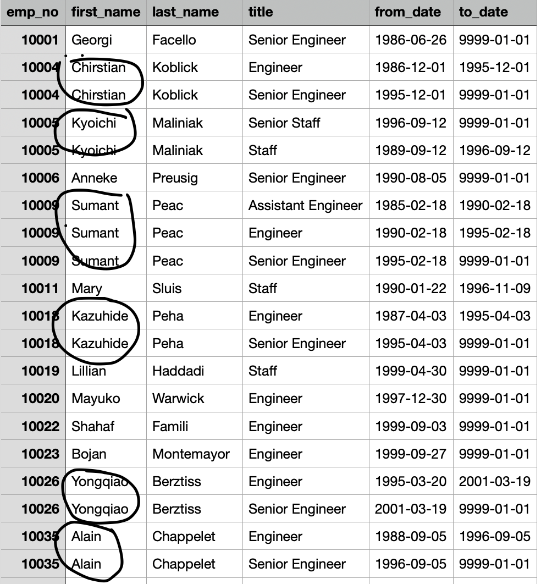
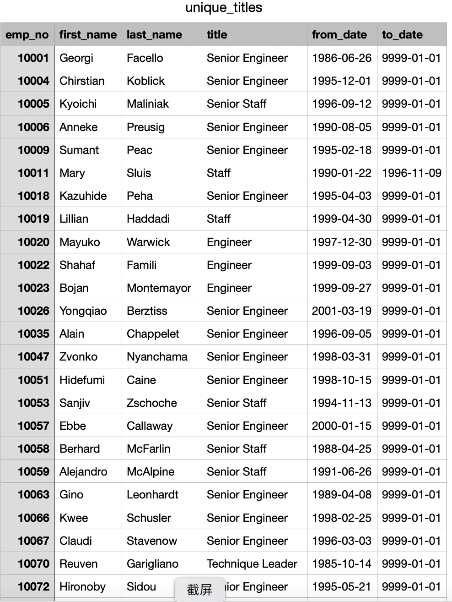
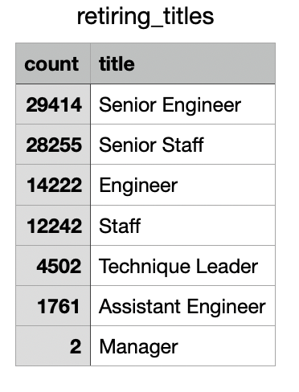
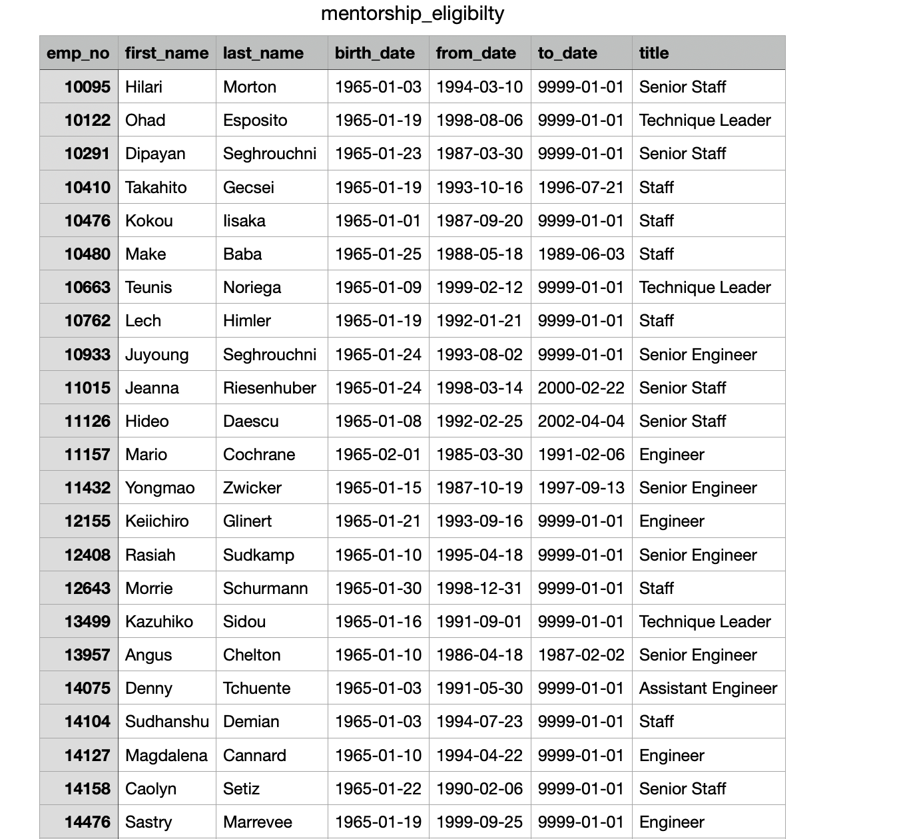
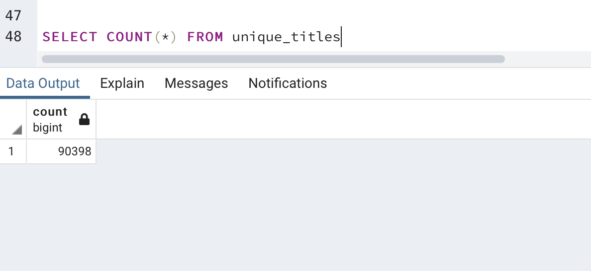
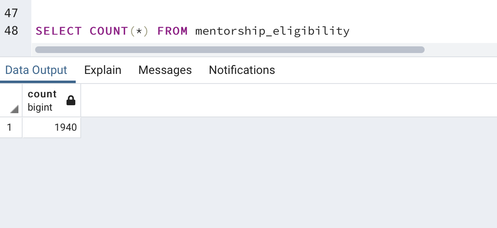

# Pewlett-Hackard-Analysis

## Overview of Project
In order to have a better understanding of what our data actually looks like, and
the relationships between different .csv files and data involved in them. Also,
what data types are involved for our data, How many CSV files are in the data.
Therefore, we are building a database for these different .csv files to discover
the relationships between these different data. Moreover, we can use the built up
database to execute queries to extract any specific data involved in the database.

## Results:

- After filtering the data on the birth_date column to retrieve the employees
  - who were born between 1952 and 1955 from data in retirement_titles.csv and
  - order by the employee number, we see that there are multiple same employees
  - with different titles, because these employees have switched titles over the years

- After applying the DISTINCT statement on the Select statement on employee number,
  - we see there are not any duplicate employee on different rows.

- After retrieving the number of employees by their most recent job title who are about to retire from
  - retiring_titles.csv, we see that senior engineer has most number of retirements.

- After filtering the data on the to_date column to get current employees whose
  - birth dates are between January 1, 1965 and December 31, 1965 from the mentorship_eligibilty.csv
  - we see there are 1941 employees.

## Summary

- How many roles will need to be filled as the "silver tsunami" begins to make an impact?

There will need 90398 roles.

- Are there enough qualified, retirement-ready employees in the departments to mentor the next generation of Pewlett Hackard employees?

Since 1940 < 90398, there are too less qualified employees to mentor the next generation of Pewlett Hackard employees.
